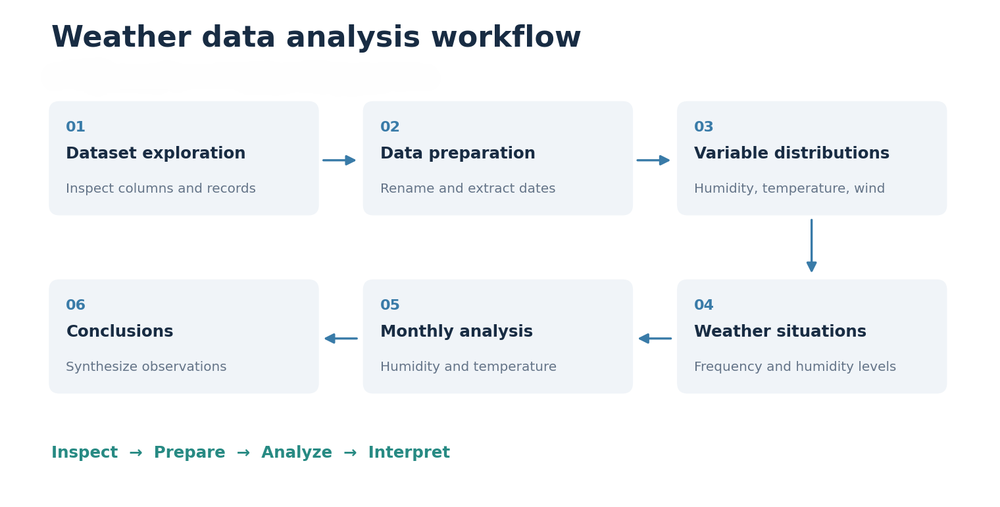
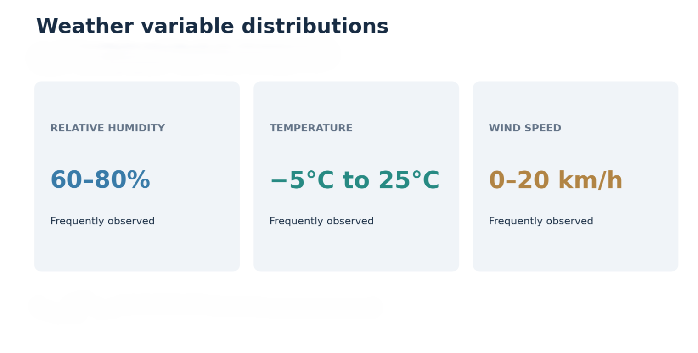
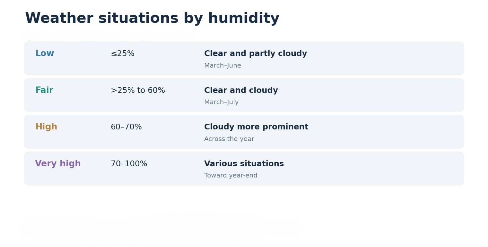
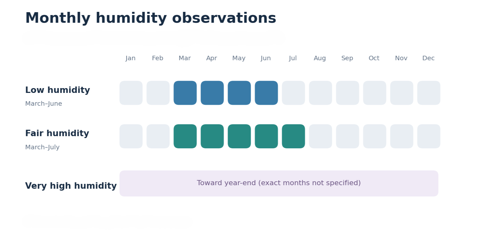

# Weather Data Analysis
### Exploratory Data Analysis and Visualization with Python

## Introduction

Weather refers to the short-term atmospheric conditions experienced at a particular location, including temperature, humidity, wind speed, precipitation, and other observable conditions. Climate, on the other hand, describes weather patterns over longer periods.

Weather observations are collected through various systems, including weather stations, satellites, radar, weather balloons, and aircraft. These observations help us understand atmospheric conditions and provide the foundation for environmental research, operational planning, and weather forecasting.

Historical weather data offers opportunities to investigate how atmospheric conditions vary across different periods. Such information is relevant to agriculture, transportation, energy demand, infrastructure, travel planning, and supply chain management.

In this project, I used **Python, Pandas, Matplotlib, and Seaborn** to perform an **Exploratory Data Analysis (EDA)** of historical weather observations, focusing on temperature, relative humidity, wind speed, and recorded weather conditions.

The investigation combines frequency distributions, categorical comparisons, and monthly analyses to identify and interpret patterns in the recorded weather conditions.

---

## Project Background and Objectives

### Why This Project?

Individual weather measurements provide information about atmospheric conditions at a particular moment. However, examining historical observations makes it possible to identify frequently occurring conditions and investigate how those conditions vary throughout the year.

For example, a temperature reading indicates how warm or cold the atmosphere was, but it does not reveal whether that temperature was common during the observation period or which months recorded similar temperatures.

Likewise, relative humidity describes the amount of moisture in the atmosphere, but examining humidity alongside recorded weather situations provides additional context about the conditions associated with different humidity levels.

This project investigates those relationships through exploratory analysis and visualization.

### Project Objective

The primary objective is to examine historical weather observations and identify meaningful patterns in temperature, relative humidity, wind speed, and atmospheric conditions.

The analysis seeks to answer the following questions:

- Which relative humidity values occur most frequently?
- What temperature and wind-speed ranges are most common?
- Which weather situations are represented in the dataset?
- How do recorded weather situations differ across humidity levels?
- During which months are different humidity conditions more prominent?
- How are different temperature ranges distributed throughout the year?

### Key Analysis Components

The original investigation was organized around two principal analytical components.

**1. Frequency Distribution Analysis**

This component examines how frequently different numerical weather measurements occur, identifying the ranges most represented in the historical observations.

**2. Weather Situation Analysis**

This component examines recorded atmospheric conditions in relation to relative humidity and calendar periods, investigating how weather situations vary across different humidity levels.

A complementary **Monthly Temperature Analysis** investigates the distribution of selected temperature ranges throughout the year.

Together, these components provide an overview of the recorded atmospheric conditions and their temporal patterns.

---

## Tools and Technologies

| Tool | Purpose |
|---|---|
| **Python** | Primary programming language for the analysis |
| **Pandas** | Data loading, inspection, preparation, filtering, and aggregation |
| **Matplotlib** | Chart creation, labeling, and formatting |
| **Seaborn** | Frequency distributions and categorical visualizations |
| **GitHub** | Project publication, documentation, and presentation |

The complete analysis is documented in the Python workflow:

[**View Project Workflow (Exploratory Analysis).py**](Project%20Workflow%20%28Exploratory%20Analysis%29.py)

---

## Dataset Overview

The project uses a historical weather dataset originally imported from a CSV file named `Weather Data.csv`.

The dataset contains date-and-time observations, numerical atmospheric measurements, and descriptions of recorded weather situations.

### Key Variables

| Variable | Description | Analytical Purpose |
|---|---|---|
| `Date/Time` | Date and time of each observation | Monthly and yearly comparisons |
| `Temp_C` | Temperature measured in degrees Celsius | Temperature distribution and monthly analysis |
| `Rel Hum_%` | Relative humidity percentage | Humidity distribution and weather-situation comparisons |
| `Wind Speed_km/h` | Wind speed measured in kilometres per hour | Wind-speed frequency analysis |
| `Weather` | Recorded atmospheric condition | Weather-situation frequency and categorical comparisons |

Other available fields were inspected during the initial dataset exploration, but the investigation concentrated on the variables relevant to its analytical objectives.

**Dataset availability:** The original CSV is not included in this repository. The published Python workflow and its documented analytical observations are preserved as the project record.

---

# Analytical Workflow

The project follows a progressive analytical approach, beginning with an examination of the source data and concluding with an interpretation of the identified patterns.



*Figure 1: Overview of the Weather Data Analysis workflow.*

The investigation is organized into eight stages:

1. Environment Setup
2. Initial Data Exploration
3. Data Preparation
4. Weather Variable Frequency Distributions
5. Weather Situation Frequency
6. Weather Situations by Humidity Level
7. Monthly Temperature Analysis
8. Analytical Conclusions

Each major analysis is presented through its **analytical question, approach, observation, and interpretation**, connecting the Python operations to the purpose and findings of the investigation.

---

## 1. Initial Data Exploration

Before examining the weather patterns, I explored the structure and contents of the imported dataset.

### Analytical Objective

Understand the available observations, identify the variables relevant to the investigation, and establish the foundation for subsequent analysis.

### Approach

The initial exploration examined:

- Dataset information and dimensions.
- Available columns and index structure.
- Variable data types.
- Missing values.
- Distinct weather descriptions.

The following Pandas operations supported the inspection:

```python
weather.info()

weather.shape

weather.index

weather.isnull().sum()

weather.dtypes

weather["Weather"].unique()
```

### Analytical Significance

Inspecting the dataset provided an understanding of the variables available for analysis and how they were represented.

Identifying the distinct weather descriptions was particularly important because those categories formed the basis of the weather-situation investigation.

The initial exploration also informed the preparation steps required for monthly comparisons.

---

## 2. Data Preparation

Following the initial inspection, the dataset was prepared for exploratory analysis.

### Analytical Objective

Improve the readability of selected variables and prepare the date field for calendar-based comparisons.

### Standardizing Column Names

Two original column names were updated to make their meaning clearer throughout the workflow.

| Original Column | Updated Column |
|---|---|
| `Rel Hum_%` | `Relative Humidity_%` |
| `Weather` | `Weather Situation` |

The transformation was performed using Pandas:

```python
weather.rename(
    columns={
        "Rel Hum_%": "Relative Humidity_%",
        "Weather": "Weather Situation"
    },
    inplace=True
)
```

### Preparing the Date Variable

The `Date/Time` column was converted to datetime format, allowing separate year and month values to be extracted.

```python
weather["Date/Time"] = pd.to_datetime(
    weather["Date/Time"]
)

weather["Year"] = weather["Date/Time"].dt.year

weather["Month"] = weather["Date/Time"].dt.month
```

### Analytical Significance

Standardizing the selected column names improved readability, while extracting calendar fields made it possible to investigate how humidity and temperature observations varied across the year.

These preparation steps supported both the numerical and temporal components of the analysis.

---

## 3. Weather Variable Frequency Distributions

The first major analytical component examined the distributions of three numerical weather measurements: relative humidity, temperature, and wind speed.

Histograms were used to identify the ranges in which observations occurred most frequently.

### 3.1 Relative Humidity Distribution

**Analytical Question:** Which relative humidity values were most frequently recorded?

**Approach:** A histogram was used to examine the distribution of `Relative Humidity_%`.

```python
sns.histplot(
    data=weather,
    x="Relative Humidity_%",
    color="skyblue"
)

plt.title("Relative Humidity Distribution")
plt.xlabel("Relative Humidity (%)")
plt.ylabel("Frequency")
plt.show()
```

**Observation:** The original analysis identified a greater concentration of relative humidity observations between approximately **60% and 80%**.

**Interpretation:** This range represented a prominent portion of the recorded humidity observations and provided a starting point for investigating the weather situations associated with different humidity levels.

### 3.2 Temperature Distribution

**Analytical Question:** Which temperature ranges occurred most frequently?

**Approach:** A histogram was used to examine the distribution of temperature measurements in degrees Celsius.

```python
sns.histplot(
    data=weather,
    x="Temp_C",
    color="skyblue"
)

plt.title("Temperature Distribution")
plt.xlabel("Temperature (°C)")
plt.ylabel("Frequency")
plt.show()
```

**Observation:** Temperatures were more frequently recorded between approximately **−5°C and 25°C**.

**Interpretation:** The observations were concentrated within a broad temperature range extending from cold to moderately warm conditions. The subsequent monthly temperature analysis examined how selected temperature ranges varied across the year.

### 3.3 Wind Speed Distribution

**Analytical Question:** Which wind-speed values were most frequently recorded?

**Approach:** A histogram was used to examine the frequency distribution of `Wind Speed_km/h`.

```python
sns.histplot(
    data=weather,
    x="Wind Speed_km/h",
    color="skyblue"
)

plt.title("Wind Speed Distribution")
plt.xlabel("Wind Speed (km/h)")
plt.ylabel("Frequency")
plt.show()
```

**Observation:** Wind speeds between approximately **0 and 20 km/h** occurred more frequently in the recorded observations.

**Interpretation:** The distribution showed a greater concentration of observations within the lower wind-speed range.

### Summary of Frequency Distribution Findings



*Figure 2: Summary of the prominent weather-variable ranges, as documented in the actual analysis.*

| Weather Variable | Prominent Range | Principal Finding |
|---|---|---|
| Relative Humidity | 60%–80% | Greater concentration of observations within this humidity range |
| Temperature | −5°C to 25°C | More frequently recorded temperature range |
| Wind Speed | 0–20 km/h | Greater concentration of observations at lower wind speeds |

**Key Finding:** The frequency distributions established the commonly observed ranges of three important atmospheric variables. However, the numerical measurements alone did not explain which weather situations accompanied those observations. And that led to the next analytical component.

---

## 4. Weather Situation Frequency

After examining the numerical variables, the investigation explored the atmospheric conditions recorded in the dataset.

### Analytical Question

Which weather situations occurred most frequently within the historical observations?

### Approach

The recorded weather descriptions were grouped and counted to examine their relative frequency.

```python
weather_situation = weather[
    ["Weather Situation", "Date/Time"]
]

weather_group = (
    weather_situation
    .groupby("Weather Situation")
    .count()
    .sort_values(
        "Date/Time",
        ascending=False
    )
)

weather_group
```

The dataset included weather descriptions such as clear, cloudy, snowy, and foggy conditions.

### Analytical Significance

Grouping weather descriptions provided a categorical perspective on the recorded atmospheric conditions.

Meanwhile, the numerical distributions described temperature, humidity, and wind-speed measurements; this analysis examined the frequency of the weather situations themselves.

The resulting categories provided the foundation for comparing atmospheric conditions across relative humidity levels.

---

## 5. Weather Situations Across Humidity Levels

The second principal analytical component investigated how recorded weather situations differed across relative humidity levels.

### Analytical Objective

Examine the weather conditions associated with different humidity ranges and investigate their monthly occurrence.

The original analysis considered four humidity categories:

| Humidity Category | Range |
|---|---|
| Low Humidity | 25% or below |
| Fair Humidity | Above 25% through 60% |
| High Humidity | 60%–70% |
| Very High Humidity | 70%–100% |

For each category, the workflow examined weather-situation frequencies and monthly distributions.

### 5.1 Low Humidity

**Analytical Question:** Which weather situations were prominent when relative humidity was 25% or below?

**Approach:** The observations were filtered to the low-humidity range and examined using categorical countplots.

```python
low_humidity = weather[
    weather["Relative Humidity_%"] <= 25
]

sns.countplot(
    x="Weather Situation",
    data=low_humidity
)

plt.xticks(rotation=45)
plt.show()
```

**Observation:** Clear and partly cloudy conditions were prominent among the low-humidity observations, particularly between **March and June**.

**Interpretation:** Lower humidity observations were frequently associated with clear or partly cloudy weather situations during the recorded period.

### 5.2 Fair Humidity

**Analytical Question:** How did weather situations vary within the fair-humidity range?

**Approach:** Observations above 25% and up to 60% relative humidity were selected for comparison.

```python
fair_humidity = weather[
    (weather["Relative Humidity_%"] > 25)
    & (weather["Relative Humidity_%"] <= 60)
]
```

Weather-situation and monthly countplots were used to examine the filtered observations.

**Observation:** Clear and cloudy conditions were both represented within the fair-humidity range. These observations appeared throughout the year, with greater frequency reported between **March and July**.

**Interpretation:** The fair-humidity category contained a mixture of recorded atmospheric conditions, demonstrating variation within the selected humidity range.

### 5.3 High Humidity

**Analytical Question:** Which weather situations were prominent at higher relative humidity levels?

**Approach:** Observations between 60% and 70% relative humidity were selected for comparison.

```python
high_humidity = weather[
    (weather["Relative Humidity_%"] >= 60)
    & (weather["Relative Humidity_%"] <= 70)
]
```

**Observation:** Cloudy conditions were more prominent within this range, although clear conditions were also recorded.

**Interpretation:** The comparison showed differences in the weather conditions associated with higher relative humidity levels.

### 5.4 Very High Humidity

**Analytical Question:** Which atmospheric conditions and monthly patterns were recorded at very high humidity levels?

**Approach:** Observations between 70% and 100% relative humidity were examined.

```python
very_high_humidity = weather[
    (weather["Relative Humidity_%"] >= 70)
    & (weather["Relative Humidity_%"] <= 100)
]
```

**Observation:** Very high humidity was recorded during the early months of the year, with greater prominence reported toward **year-end**.

**Interpretation:** The monthly distribution indicated that very high humidity observations varied across the year.

### Humidity-Level Findings



*Figure 3: Summary of the weather condition observed across humidity levels.*

| Humidity Category | Documented Observation |
|---|---|
| Low | Clear and partly cloudy conditions were prominent |
| Fair | Clear and cloudy conditions were both represented |
| High | Cloudy conditions became more prominent |
| Very High | Observations showed greater prominence toward year-end |

**Key Finding:** The humidity-level comparisons revealed differences in recorded weather conditions, and that shows the importance of examining atmospheric descriptions alongside numerical humidity measurements.

---

## 6. Monthly Humidity Patterns

The humidity investigation also examined how frequently different humidity conditions occurred across calendar months.

### Analytical Question

During which months were the selected humidity categories more prominent?

### Approach

Monthly countplots were used to examine the frequency of observations within each humidity category.

For example, the low-humidity monthly distribution was examined using:

```python
sns.countplot(
    x="Month",
    data=low_humidity
)

plt.title("Monthly Frequency of Low Humidity")
plt.xlabel("Month")
plt.ylabel("Observation Count")
plt.show()
```

The same approach was applied to the remaining humidity categories.

### Observations

- **Low Humidity:** More prominent around March–June.
- **Fair Humidity:** Greater frequency reported around March–July.
- **High Humidity:** Observations appeared across different periods of the year.
- **Very High Humidity:** Recorded early in the year, with greater prominence toward year-end.



*Figure 4: Qualitative timeline of the periods highlighted in the original humidity analysis.*

The timeline summarizes the documented periods of prominence rather than monthly observation counts.

### Analytical Significance

The humidity-level comparisons described the weather situations associated with different humidity ranges, while the monthly comparisons provided additional context about when those conditions occurred.

Together, these analyses helped describe the temporal variation in the humidity observations.

---

## 7. Monthly Temperature Analysis

The final exploratory component examined the monthly distribution of selected temperature ranges.

### Analytical Question

How were different temperature ranges distributed throughout the year?

### Approach

The analysis examined four temperature categories:

| Temperature Category | Range |
|---|---|
| Cold | 10°C or below |
| Low | 10°C–20°C |
| Fair | 20°C–30°C |
| High | 30°C–40°C |

Each category was filtered separately and examined using monthly countplots.

For example:

```python
cold_temperature = weather[
    weather["Temp_C"] <= 10
]

sns.countplot(
    x="Month",
    data=cold_temperature
)

plt.title("Monthly Frequency of Cold Temperatures")
plt.xlabel("Month")
plt.ylabel("Observation Count")
plt.show()
```

The same procedure was applied to the remaining temperature categories.

### Interpretation

The overall temperature histogram identified the range in which temperatures were most frequently recorded.

The monthly countplots complemented that finding by examining when different temperature categories occurred.

Together, the two approaches provided an overall and calendar-based perspective on temperature variation within the historical observations.

---

## 8. Consolidated Analytical Findings

The investigation produced several observations across its numerical, categorical, and temporal analyses.

| Analytical Area | Principal Finding |
|---|---|
| Relative Humidity | Greater concentration of observations around 60%–80% |
| Temperature | More frequent observations around −5°C to 25°C |
| Wind Speed | More frequent observations around 0–20 km/h |
| Low Humidity | Clear and partly cloudy conditions were prominent |
| Fair Humidity | Clear and cloudy conditions were both represented |
| High Humidity | Cloudy conditions became more prominent |
| Very High Humidity | Greater prominence toward year-end |
| Monthly Humidity | Notable low- and fair-humidity periods around March–July |
| Monthly Temperature | Selected temperature ranges were compared across calendar months |

Three important insights emerged from the investigation.

**First, frequency distributions established the commonly observed atmospheric measurements.** The humidity, temperature, and wind-speed histograms provided an initial picture of the weather conditions.

**Second, categorical comparisons added context to numerical measurements.** Examining weather situations across humidity levels revealed differences in the atmospheric conditions associated with lower and higher relative humidity.

**Third, monthly comparisons introduced a temporal perspective.** Investigating humidity and temperature by month helped describe how different conditions varied throughout the year.

---

## Practical Implications

Weather data analysis provides useful information for sectors where atmospheric conditions influence planning, operations, and resource allocation.

### Agriculture and Commodity Markets

Temperature, humidity, and precipitation patterns can influence agricultural activities and commodity-market decisions. Historical weather analysis provides context for understanding the atmospheric conditions relevant to seasonal planning and crop management.

### Energy and Utilities

Utility companies use temperature forecasts to estimate energy demand. Historical temperature patterns can contribute to understanding seasonal conditions relevant to energy consumption and resource planning.

### Transportation and Travel Planning

Weather conditions affect visibility, road conditions, aviation, and other transportation activities. Investigating the frequency of atmospheric situations can provide useful context for planning around weather-related disruptions.

### Supply Chain Management

Weather information can support decisions involving logistics, inventory, and customer demand. Understanding historical conditions provides additional context for investigating weather-related operational challenges.

### Public Safety and Infrastructure

Weather monitoring and forecasting play important roles in protecting lives, property, and infrastructure. Although this project does not produce forecasts, its exploratory approach demonstrates how atmospheric observations can be examined to support weather-related understanding.

---

## Limitations

The investigation focuses on descriptive analysis of historical weather observations rather than implementing a weather-forecasting model.

The identified patterns describe the conditions represented in the dataset and do not establish causal relationships between atmospheric variables.

### Broader Weather Forecasting Limitations

Weather forecasting also presents challenges beyond the scope of this exploratory investigation.

The atmosphere is dynamic and sensitive to changes in its initial conditions, placing practical limits on the reliability of long-range predictions.

Modern forecasting commonly uses **Numerical Weather Prediction (NWP)** models, which simulate atmospheric behavior through mathematical equations.

However, such models can have difficulty representing smaller-scale atmospheric processes, including localized wind patterns, small-scale precipitation, and atmospheric turbulence.

These challenges highlight the distinction between examining historical observations and predicting future weather conditions.

The present project remains focused on understanding the recorded weather data through exploratory analysis.

---

## What I Learned

This project strengthened my understanding of how Python can be used to investigate environmental data and communicate analytical findings.

### Data Exploration

Inspecting dataset structure, variables, missing values, and data types helped establish the foundation for the investigation.

### Data Preparation

Standardizing selected column names and extracting calendar fields made the dataset easier to use for categorical and monthly comparisons.

### Frequency Distributions

Histograms provided a practical way to identify the ranges most frequently represented in numerical weather measurements.

### Categorical Comparisons

Examining weather situations across humidity levels added context that could not be obtained from numerical distributions alone.

### Temporal Analysis

Monthly comparisons provided an additional perspective on how different humidity conditions and temperature ranges were distributed throughout the year.

### Analytical Documentation

The project reinforced the importance of connecting analytical questions, methods, observations, and interpretations.

Clear documentation makes the investigation easier to understand and helps communicate the reasoning behind each analytical step.

---

## Conclusion

The Exploratory Data Analysis of the weather dataset revealed several patterns in the recorded atmospheric observations.

Through frequency distributions, categorical comparisons, and monthly visualizations, the investigation provided a clearer understanding of the weather conditions represented in the historical records.

The temperature analysis examined the frequency of different temperature ranges and their monthly variation. The humidity analysis explored the weather conditions associated with selected humidity levels, including clear and cloudy conditions.

Other atmospheric situations, such as snowy and foggy weather, broadened the range of conditions represented in the investigation.

Together, these analyses helped describe the frequency and seasonal occurrence of different atmospheric states.

Overall, the project demonstrates how Python-based exploratory analysis can transform historical weather observations into meaningful, interpretable findings.

---

## Repository Structure

```text
Weather_Data_Analysis/
│
├── media/
│   ├── 01_weather_variable_distributions.png
│   ├── 02_humidity_weather_findings.png
│   ├── 03_monthly_humidity_timeline.png
│   └── 04_analysis_workflow.png
│
├── Project Workflow (Exploratory Analysis).py
│
└── README.md
```
